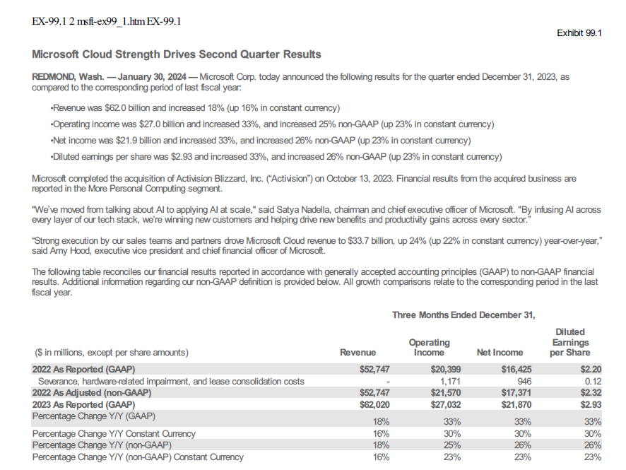

# 10-K, 10-Q, and 8-K Reports from SEC Database in Streamlit
#### _Includes Exhibit 99.1 Reports_
 



- SEC Main Page: https://www.sec.gov/
- SEC Developer Resources: https://www.sec.gov/developer

## Overview
The program creates 10-K, 10-Q, or 8-K exhibit 99.1 reports using data from the SEC database (EDGAR). The user 
inputs a stock ticker, selects the report type, your email address (to access EDGAR), and the number of reports desired.  

For the reports, the query results will be displayed (maximum of 12) and the user can select "create report".  The
report will create a link to the report, a downloadable pdf link, and display the report in a window. 

When the report is complete, a summary of the report can be created using OpenAI models.  The summarize report also
includes an estimated cost at the completion of the summary.  These are the models that are available in the program:
* gpt-4o-mini
* gpt-3.5-turbo
* gpt-4

Additional models can be added in the future, but the _gpt-4o-mini_ is the cheapest model and seems to perform the best
for the task.  

For information on Open AI models and to get an API key:
- To get an API key: https://platform.openai.com/api-keys
- For the latest models: https://platform.openai.com/docs/models
- For model pricing: https://openai.com/pricing

**Notes:** 
* The program only works locally in Streamlit.  When deployed, there is an issue with accessing _wkhtmltopdf_
locally on your computer.  There are some cloud HTML to PDF converters, but I have not found a free unlimited version.
* Summarize does not work with newer versions of Open AI (>=1.0.0).

## Terms
* SEC Form 10-K: an annual report that public companies must file with the Securities and Exchange Commission (SEC) 
to provide a comprehensive summary of their financial performance, including audited financial statements, management 
discussion and analysis, and other disclosures.
* SEC Form 10-Q: a quarterly report that public companies must file with the SEC to provide a summary of their financial 
performance for the past three months, including unaudited financial statements, management discussion and analysis, 
and other disclosures.
* SEC Form 8-K: a report that companies must file with the Securities and Exchange Commission (SEC) to announce major 
events that shareholders should know about.
* SEC Exhibit 99.1: a document that is filed with the Securities and Exchange Commission (SEC) by companies to provide 
additional information about a particular event or transaction.
* CIK: Central Index Key-EDGAR uses this number to identify a Company 
* Ticker: ticker of a stock (example: Microsoft ticker is MSFT)

## Notes on pdfkit
* Requires _wkhtmltopdf_ to be installed 
* This is a setup has been tried in a Windows environment only.
* Set the path to your _wkhtmltopdf.exe_
* If you are having issues, add it to your PATH environmental variables
* Check the wkhtmltopdf github for more info: https://github.com/JazzCore/python-pdfkit/wiki/Installing-wkhtmltopdf
```
# Set your path in the create pdf function
os.environ['PATH'] += os.pathsep + 'C:\\.....\\bin'

config = pdfkit.configuration(wkhtmltopdf='C:\\......\\bin\\wkhtmltopdf.exe')
```
* If you are having issues or getting errors when converting from HTML to PDF, set verbose=True in the code below for 
additional debug information.   
```
pdf = pdfkit.from_string(html_content,
                         False, 
                         configuration=config, 
                         options={"enable-local-file-access": None},
                         verbose= True)
```